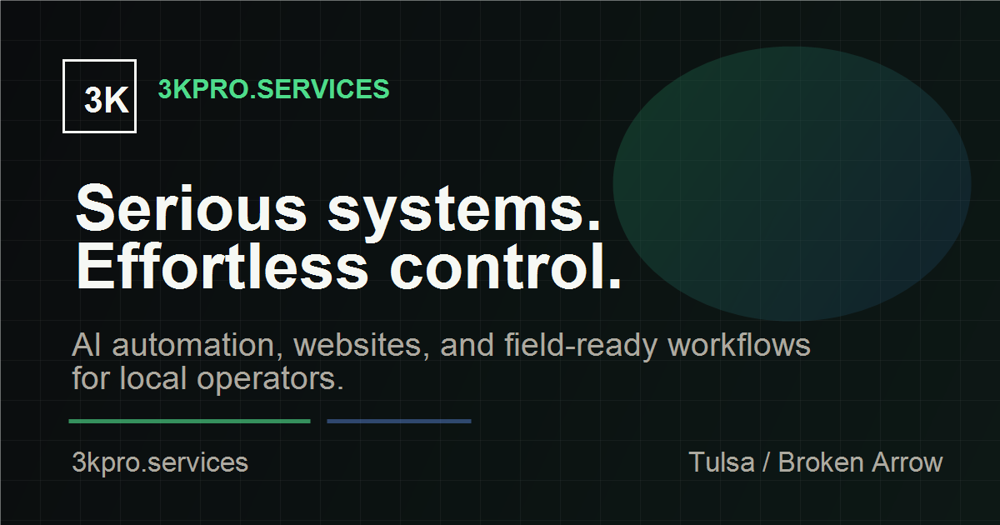

  

# James Lawson

**Infrastructure engineer building practical software and automation | Founder, 3KPRO.Services**

I bring roughly 20 years of IT operations experience across support, infrastructure, and field deployments. My work with ONEOK, PSO, and Enerflex shaped how I build: clear runbooks, observable systems, and tools that someone else can maintain.

Today I build and document software projects in public. I am based near Tulsa, Oklahoma and open to thoughtful collaboration on developer tooling and operational automation.

[3kpro.services](https://3kpro.services) · [james@3kpro.services](mailto:james@3kpro.services)

## Start Here

| Project | Why look at it |
| --- | --- |
| [**misfire**](https://github.com/3kpro/misfire) | A zero-dependency Node CLI for inspecting agent skill descriptions, possible trigger collisions, and context budget. Includes runnable tests and an npm package. |
| [**3KPRO.Services**](https://github.com/3kpro/3kpro-website) | The public Next.js source for my business website. [View the site](https://3kpro.services). |
| [**3K Trading Bot**](https://github.com/3kpro/3K_Trading_Bot_V2) | An experimental Python strategy and dashboard project. Backtests are simplified, paper signals are hypothetical, and live orders are disabled. |

## Collaborate

Open an issue in the relevant repository with the problem you want to solve and the change you propose. For code changes, a focused pull request with a reproducible test is the fastest way to start.

## How I Work

- Verify behavior with tests and the running system.
- Keep people in control of external sends, money, and production changes.
- Document decisions so another operator can continue the work.
- Ship useful increments and improve them with evidence.

**Building something operationally messy?** [Send me the problem](mailto:james@3kpro.services).
